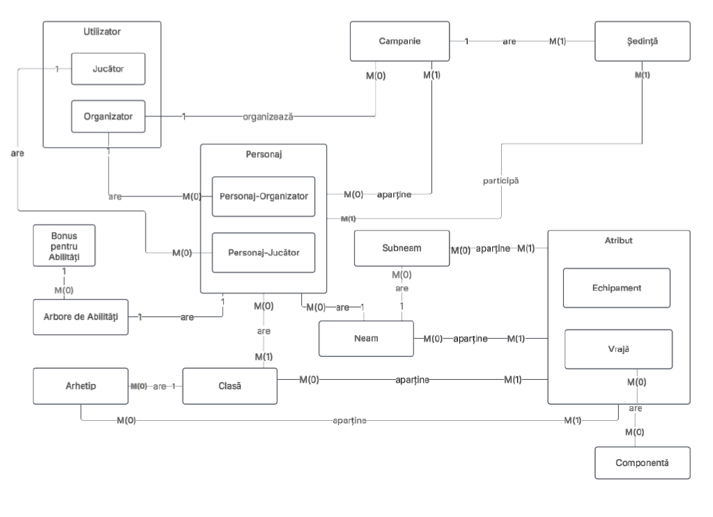

# Dungeons and Dragons Management Database

Welcome to the D&D Character and User Management Database, a structured and extensible system for managing **players, characters, campaigns, classes, races**, and **magical equipment** in a tabletop RPG setting.

This schema supports key RPG concepts such as **multi-classing, subraces, magic systems, and character abilities**, and is designed to be used by both **players (jucatori)** and **organizers (organizatori)** of campaigns.

---

## 📚 Table of Contents

- [Purpose](#purpose)
- [Entity Overview](#entity-overview)
- [Key Concepts](#key-concepts)
- [Database Schema](#database-schema)
- [Data Integrity](#data-integrity)
- [Sequences](#sequences)
- [Future Improvements](#future-improvements)

---

## 🎯 Purpose

The database is designed to store, organize, and enforce rules for a D&D-like game system. It ensures consistency, validation, and flexibility for:

- User registration and role management
- Campaign creation and session scheduling
- Character creation and progression
- Races (`neam`), subraces (`subneam`), classes, and archetypes (`arhetip`)
- Magic items, weapons, and spells
- Ability scores and derived bonuses

---

## 🧩 Entity Overview

Here is a high-level overview of the key components:

| Entity            | Description |
|------------------|-------------|
| `utilizator`     | Represents a user of the system (player or organizer) |
| `campanie`       | A game campaign managed by an organizer |
| `sedinta`        | Individual sessions in a campaign |
| `personaj`       | Player characters with races, abilities, and personalities |
| `clasa`, `arhetip` | RPG classes and their special archetypes |
| `neam`, `subneam` | Character races and subraces |
| `atribut`        | Generic attributes (can be spells or equipment) |
| `echipament`     | Equipment items extending attributes |
| `vraja`          | Spells extending attributes |
| `arbore_de_abilitati` | Ability score tree for each character |
| `bonus_abilitati` | Bonus derived from ability scores |
| `componenta`     | Spell components |
| ... and mapping tables such as `item_clasa`, `item_arhetip`, etc.

---

## ⚙️ Key Concepts

### Single Table Inheritance

Used in:
- `utilizator` → differentiates `jucator` and `organizator`
- `atribut` → superclass for `echipament` and `vraja`

### Class Table Inheritance

Used for:
- Subtypes such as `echipament` and `vraja` to extend `atribut`
- Allows spells and equipment to share metadata

### Many-to-Many Relationships

Examples:
- `personaj_clasa`: characters can multiclass
- `item_arhetip`, `item_clasa`, etc.: items linked to different entities

---

## 🧱 Database Schema

Simplified version: 

```plaintext
utilizator
│
├── campanie
│   └── sedinta
│
├── personaj
│   ├── personaj_clasa
│   ├── personaj_campanie
│   └── arbore_de_abilitati
│
├── clasa ──┬── arhetip
│          └── item_clasa
│
├── neam ───┬── subneam
│          └── item_neam
│
├── atribut ──┬── echipament
│            ├── vraja ── componenta_vraja
│            └── linked to neam, clasa, arhetip, subneam
│
└── bonus_abilitati
```

ERD:




### For more details do look into the `.Documentatie.pdf` file